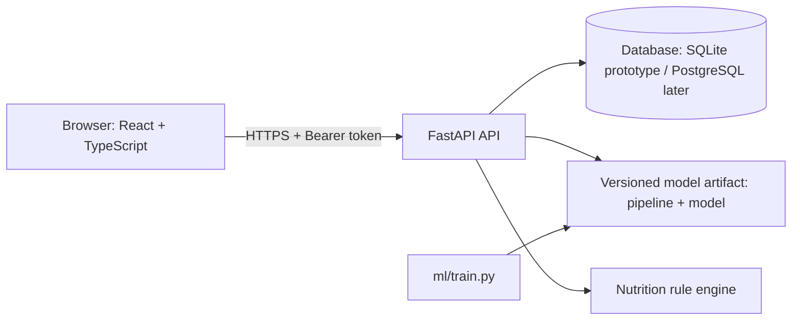
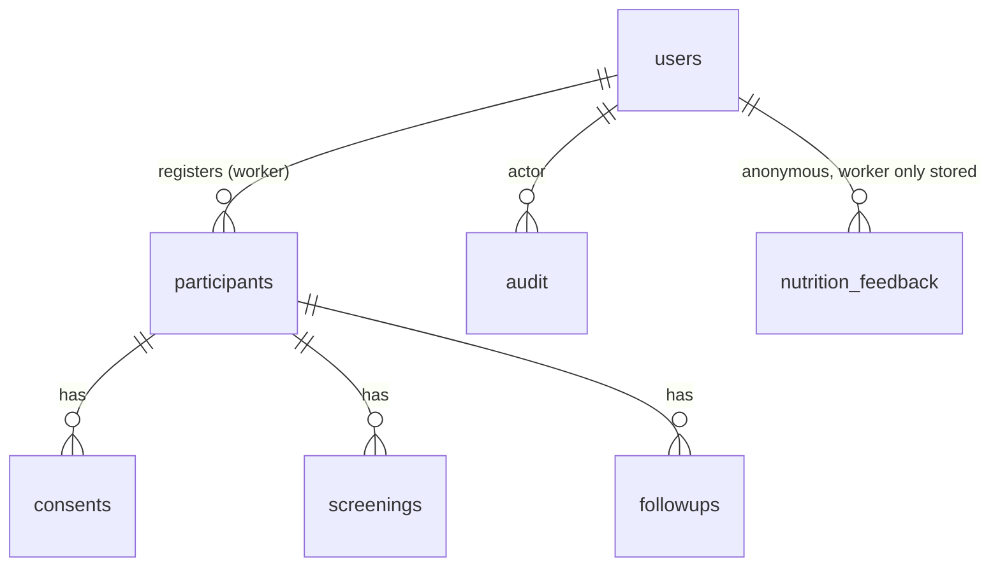

# RuralCare AI: architecture and database

```mermaid
flowchart LR
  U[Browser: React + TypeScript] -->|HTTPS + Bearer token| A[FastAPI API]
  A --> D[(Database: SQLite prototype / PostgreSQL later)]
  A --> M[Versioned model artifact: pipeline + model]
  T[ml/train.py] --> M
  A --> N[Nutrition rule engine]
```

```mermaid
erDiagram
  users ||--o{ participants : "registers (worker)"
  participants ||--o{ consents : has
  participants ||--o{ screenings : has
  participants ||--o{ followups : has
  users ||--o{ audit : "actor"
  users ||--o{ nutrition_feedback : "anonymous, worker only stored"
```
Roles: admin (accounts, audit, system), worker (own participants), researcher (aggregates, model results). Server-side checks on every endpoint.
